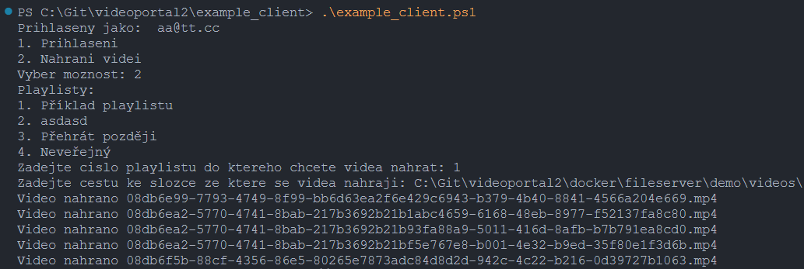

# Example client
Ukázka implementace klienta který slouží pro hromadné nahrávání již existujících souborů.

# Instalace
### Powershell
Klient je vytvořen pro novou verzi powershellu (pwsh.exe), která je postavená nad .NET.
Nainstalovat si ji lze dle návodu zde:
- *https://learn.microsoft.com/en-us/powershell/scripting/install/installing-powershell-on-windows*

*Obecně by klient šel použít i s původní verzí Windows PowerShell, která však v Invoke-WebRequest nepodporuje parametr -Form, bylo by třeba přepsat parametr do odpovídající podoby pro původní verzi.

### FFmpeg
Pro použití powershell klienta (pro generování thumbnail a zjištění délky videa) je třeba knihovna FFmpeg.
Stáhnout se dá například zde:
- *https://www.gyan.dev/ffmpeg/builds/ffmpeg-git-essentials.7z*

Po stažení a robalení je třeba nakopírovat ffmpeg.exe a ffprobe.exe do složky s example_client.ps1.
Případně lze změnit cestu k ffmpeg přímo v .ps1 skriptu.

*Původně jsem se snažil do skriptu zahrnout i stažení ffmpeg avšak jelikož se jedná o archiv 7z což ne všechny windows umí rozbalit, tak jsem tenhle krok nechal na manuální instalaci.*

# Použití
Skript lze spustit příkazem *./example_client.ps1*
- Po spuštění skriptu je třeba se nejprve přihlásit volbou Přihlášení "1".
- Po přihlášení je možné zvolit v menu volbu Nahrání videí"2".
- Nejprve je potřeba zvolit playlist do kterého chcete videa nahrát.
- Poté zadat cestu ke složce ve které máte uložená videa.
- Videa se poté samy ze složky nahrají.

# Konfigurace
Skript lze libovolně upravit dle vašich potřeb, jedná se spíš jen o ukázku jakým způsobem je možné s API komunikovat.