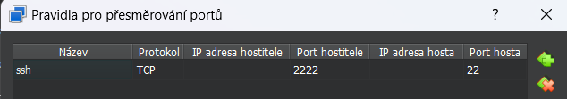
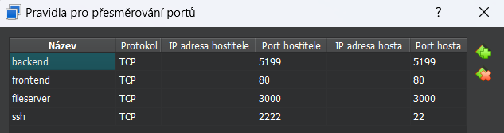

# Video portál
**(Pro instalaci v rámci hodnocení bakalářské práce prosím přejděte na sekci Standalone nasazení, děkuji.)**
Webová aplikace sloužící k nahrávání a přehrávání videa.
Jedná se o full-stack projekt, tedy .NET server a react klient.

Vyrobeno jako projekt pro bakalářskou práci.

## Funkcionality

- nahrávání a přehrávání videa
- přihlášení, registrace a správa uživatelů
- tvoření playlistů
- generování náhledu videa
- komentáře, hodnocení
- tagy
- uživatelské skupiny
- vlastní hostování

## Architektura

Aplikace se skládá z backendu který je napsaný v .NET, pro komunikaci s MySQL databází se využívá framework EFCore.\
Backend vystavuje své rozhraní pomocí [Swaggeru](https://videoportal.panda7789.fun/api/swagger)\
S backendem komunikuje frontend který je napsaný nad Reactem.
Pro generování rozhraní je využívána knihovna [react-query-swagger
](https://github.com/shaddix/react-query-swagger).

## Požadavky na spuštění

Demo aplikace běží na adrese (https://videoportal.panda7789.fun), zde je možné si aplikaci vyzkoušet.

Pro testování byl vytvořen docker-compose, který jediným příkazem spustí všechno potřebné. \
Samozřejmě je možné hostovat i jednotlivé komponenty aplikace zvlášť, například pokud již mám existující databázi a chci ji využít.

### Naklonování aplikace
Zdrojové kódy je možné naklonovat pomocí:
```
git clone https://github.com/panda7789/videoportal2 --depth 1
```
případně přímo stáhnout backend a frontend zkompilovaný z release [repozitáře](https://github.com/panda7789/videoportal2/releases), případně jako zipy v příloze bakalářské práce.

## Docker
Pokud si chceme aplikaci vyzkoušet, nebo přispět k vývoji, je určitě vhodné využít docker kontejnery.

<details>
  <summary>Docker</summary>
Pokud již máte docker nainstalovaný, můžete rovnou přeskočit na další sekci.

<details>
  <summary>Instalace dockeru</summary>

### Windows

<details>
  <summary>Instalace dockeru na windows</summary>
Docker nainstalujeme dle návodu (https://docs.docker.com/desktop/install/windows-install/). Já zvolil verzi Docker for Windows, která obsahuje jak potřebný Docker tak Docker compose, avšak tyto aplikace je možné nainstalovat i samostatně.
</details>

### Ubuntu server

<details>
  <summary>Poznámka pro virtuální ubuntu server</summary>
Při zvolení image ubuntu server, je nejprve potřeba nainstalovat docker.
Jelikož přes virtualbox nejde pohodlně vkládat příkazy ze schránky do gui-less prostředí, využíval jsem pro připojení SSH.
SSH server již ve výchozím stavu běží, je tedy potřeba přidat pouze přesměrování.
Nastavení (VM) -> Síť -> Pokročilé -> Předávání portů -> Zde založit záznam dle obrázku.

Poté je možné se do VM připojit přes jakéhokoliv SSH klienta (putty, kitty) pod adresou localhost:2222.

Kromě tohoto SSH portu je potřeba ještě přidat další porty (10003 - frontend, 10004 - backend, 10005 - fileserver) pro funkčnost aplikace.


</details>
<details>
  <summary>Podrobná instalace Dockeru</summary>
Postupoval jsem dle oficiální dokumentace.

1. přidání docker repozitáře

```
sudo apt-get update
sudo apt-get install ca-certificates curl gnupg

sudo install -m 0755 -d /etc/apt/keyrings
 curl -fsSL https://download.docker.com/linux/ubuntu/gpg | sudo gpg --dearmor -o /etc/apt/keyrings/docker.gpg

 sudo chmod a+r /etc/apt/keyrings/docker.gpg
 echo \
  "deb [arch="$(dpkg --print-architecture)" signed-by=/etc/apt/keyrings/docker.gpg] https://download.docker.com/linux/ubuntu \
  "$(. /etc/os-release && echo "$VERSION_CODENAME")" stable" | \
  sudo tee /etc/apt/sources.list.d/docker.list > /dev/null
```

2. stažení informací o novém repozitáři

```
sudo apt-get update
```

3. samotná instalace Dockeru

```
 sudo apt-get install docker-ce docker-ce-cli containerd.io docker-buildx-plugin docker-compose-plugin
```

</details>
</details>

### Spuštění bez dat

Pokud chcete spustit docker stack bez dat je možné využít následující postup.

<details>
  <summary>Spuštění bez dat</summary>
Pro jednoduché spuštění je vytvořen ve složce _docker_ soubor _docker-compose.yml_.
V PowerShellu otevřeme zmíněnou složku /docker a spustíme příkaz:

```powershell
docker compose --file docker-compose.yml up --build
```

Tento příkaz vytvoří a spustí následující kontejnery:

- frontend
  - kontejner vytvoří webový server nad zkompilovanou veřejnou částí aplikace
  - definice image - /frontend/Dockerfile
  - vystavený port 10003, vnitřní 80
- api
  - kontejner vytváří serverovou část aplikace
  - definice image - /backend/Backend/Dockerfile
  - vystavený port 10004, vnitřní 5199
  - namapuje složku pro nahrávání souborů
- db
  - databáze slouží pro uložení dat
  - oficiální image mysql
  - vystavený port 3306
  - data ukládá do adresáře /docker/db/data
  - přihlašovací údaje je možné dohledat v definici
- file-server
  - kontejner zpřístupní obsah složky na http rozhraní
  - definice image - /docker/fileserver/dockerfile
  - vystavený port 10005, vnitřní 3000
  - data ukládá do adresáře /docker/fileserver/data
- wait-for-db
  - kontejner čeká až bude připravena databáze a až poté spouští další části aplikace

Po spuštění běží aplikace na adrese

> <http://localhost:10003>

Ve výchozím stavu se vytvoří administrátorský účet:

> uživatelské jméno: admin@admin.cz\
> heslo: 123

</details>

### Spuštění DEV prostředí

Pokud chcete mít aplikaci spuštěnou přes vývojové prostředí, může se hodit kontejner, který zajistí jen databázi a fileserver.

<details>
  <summary>Spuštění dev prostředí</summary>
Kromě již zmíněných docker compose souborů existuje ještě _docker-compose-dev.yml_, který složí primárně pro vývoj.

Kontejnery je možné spustit příkazem:

```
docker compose --file docker-compose-dev.yml up --build
```

Po spuštění je vytvořena databáze, backendový server a fileserver.
Bohužel se mi nepodařilo přidat i vývojový kontejner pro frontendovou část aplikace. Tu si je tedy nutné spustit bokem.

Nejprve je potřeba otevřít projekt _/frontend_ ve VS Code (případně jiném editoru). \
Nainstalovat npm balíčky přes příkaz

```
npm i
```

a poté spustit frontend lokálně přes příkaz

```
npm run start
```

Po spuštění příkazu se spustí vite server, který aplikaci zkompiluje a spustí.\
Poté stačí upravit jakýkoliv soubor v projektu, nástroj vite změnu zdetekuje a potřebné části aplikace překompiluje. V otevřeném prohlížeči se tak provedené změny projeví automaticky, případně po manuálním obnovení stránky.

</details>
</details>

## Standalone nasazení

Aplikaci je možné provozovat také jako každou komponentu samostatně.

<details>
  <summary>Standalone</summary>

### Backend

Pro backend budete potřebovat zkompilovanou verzi aplikace. Poslední taková se nachází [zde](https://github.com/panda7789/videoportal2/releases), případně ji najdete jako přílohu k textu BP.
Tyto soubory je poté nutné nasadit na webový server umožňující provozovat ASP.NET aplikaci. Například IIS na Windows Server, nebo Nginx na Linux. Případně lze aplikaci nasadit do cloudu, který ASP.NET podporuje, třeba Azure. Zde budu uvádět detailně příklad nasazení aplikace na Windows Server.

#### Databáze

Aplikace ke svému běhu potřebuje MySQL databázi.
Tu je možné nainstalovat pomocí MySQL instalátoru [zde](https://dev.mysql.com/downloads/installer/).

V instalátoru vybrat volbu Server only, která pro hostování databáze dostačuje.
Poté proklikat instalátor a nakonfigurovat ve volbě Config Type - Server Computer, případně upravit porty. Poté je potřeba vyplnit root heslo, vyplnit údaje pro Windows službu a konfiguraci potvrdit.

Databázovou strukturu si vytváří backend sám při prvním spuštění.

#### IIS

Pro instalaci lze postupovat dle [návodu](https://learn.microsoft.com/en-us/aspnet/core/tutorials/publish-to-iis), avšak základní kroky zde shrnu.

Nejprve je potřeba přidat serverovou roli _Web Server (IIS)_, přes Server Manager.
Poté je potřeba nainstalovat _ASP.NET Hosting Bundle_, který lze stáhnout z [adresy](https://dotnet.microsoft.com/en-us/download/dotnet/6.0), v sekci ASP.NET Core Runtime, v tabulce a řádku Windows odkaz s názvem "Hosting Bundle". Je důležité stáhnout verzi pro .NET 6, jelikož pro tuhle verzi je aplikace napsaná a zkompilovaná jako framework-dependent, kdyby byla zkompilovaná s příznakem self-contained, obsahovala by již všechny potřebné dll.

Po nainstalování je potřeba překopírovat zkompilovanou verzi aplikace do některé lokální složky na serveru.

V IIS je nutné pro aplikaci vytvořit vlastní aplikační pool, jelikož pro aplikace v .NET není možné používat společný pool pro více aplikací, tak jak tomu je například u .NET Framework aplikací.

Poté je potřeba vytvořit novou Site, kde se vybere vytvořený pool a určí cesta do složky se zkompilovanou aplikací.
Po vytvoření site, může být potřeba aplikační pool případně i site spustit tlačítkem Start.

Před spuštěním si zkontrolujte správné nastavení connection stringu do databáze a venkovní URL na souborový server v konfiguračním souboru _appsettings.json_, umístěný ve složce s aplikací.

První spuštění může trvat delší dobu, jelikož se aplikují databázové migrace, které vytváří potřebné struktury. Z tohoto důvodu je v souboru _web.config_ prodloužen timeout startu aplikace z 2 na 10 minut. V případě, že je aplikace při aplikování databázových migrací zastavena, může dojít k tomu, že některá migrace doběhla jen částečně. Jelikož EF Core neumí spouštět migrace v transakcích, které by šly v případě chyby odrolovat, je nutné databázi smazat a začít znovu, případně dle povahy chyby opravit databázovou strukturu.

V případě problémů lze v Event Viewer ve složce Windows Logs položce Application nalézt chybové hlášky. Případně v souboru _web.config_ lze zapnout podrobné logování proměnnou _stdoutLogEnabled_ na true. Poté bude veškerá komunikace dostupná ve složce logs.

Pokud vše proběhlo správně, lze na adrese serveru a cestě _/api/swagger/index.html_, nalézt dokumentaci k rozhraní a možnost si API vyzkoušet.

Při nestandardních portech může být ještě potřeba přidat pravidlo s daným portem do firewallu, přes aplikaci "Windows Defender Firewall with Advanced Security".

#### Kompilace

Pokud chcete provádět změny, můžete si otevřít _/backend/Backend.sln_ například ve Visual Studio 2022.
Provést dané úpravy a aplikaci zkompilovat v release konfiguraci.
Pokud byla úprava v rámci zdrojového kódu, bude stačit na server nahrát soubor _Backend.dll_.

Pokud se jedná o úpravu většího charakteru (například přidání další knihovny), bude nutné aplikaci zkompilovat volbou publish, která obsahuje všechny potřebné soubory k nasazení. Touto volbou publish je vydáván i zip s releasem aplikace na GitHub.

### Frontend

Pro nasazení frontendu budete také potřebovat zkompilovanou verzi aplikace.
Můžete použít již zkompilovanou verzi [zde](https://github.com/panda7789/videoportal2/releases) (případně ji najdete jako přílohu k textu BP). Složku stačí zkopírovat na jakýkoliv webový server, já opět využiji IIS na Windows Serveru. Případně lze využít i další webové servery jako Apache nebo Nginx, jelikož se jedná opravdu jen o HTML a JS soubory, které nepotřebují žádný další runtime.

#### IIS

Zkompilované soubory si překopírujeme do lokální složky na serveru.
V IIS opět v Sites vytvoříme novou site, kde vyplníme název, cestu k adresáři a port.
Pro frontend doporučuji port 443 případně 80, jelikož se tyto porty nemusí v rámci url uvádět.

Pokud byl vybrán nestandardní port, je opět nutné přidat pravidlo do firewallu, viz sekce backend.

Dále je potřeba nastavit redirect pravidlo. Nejprve je potřeba nainstalovat Rewrite modul z [URL](https://www.iis.net/downloads/microsoft/url-rewrite). Po nainstalování a restartování IIS lze v konfiguraci frontend site nalézt volbu URL Rewrite.
Zde by již mělo jedno pravidlo být z instalace, případně pokud není je potřeba zkopírovat soubor web.config z release verze frontendu. Pravidlo zajistí, že veškeré dotazy na frontend, které nejsou dotaz na soubor nebo složku, budou vždy směrovat na index.html který si s nimi poradí. Pokud nebude používán IIS, je potřeba hledat na internetu výraz "React-router and [váš server] rewrite".

Frontendová aplikace potřebuje pouze konfiguraci url na API rozhraní. Tuhle konfiguraci je možné změnit přímo v souboru _index.html_, v body při zavádění globální proměnné `import_meta_env`, kde se jedná o položku API_URL. Takto změnit index.html je nejjednodušší varianta konfigurace.

Pokud by konfigurace do budoucna bylo více a nastavení by již bylo nepřehledné, je možné využít npm balíček _import-meta-env_, který po spuštění příkazu:

`npx import-meta-env -x .env -p index.html`

upraví _index.html_ dle daného .env souboru. Příklad .env souboru lze najít ve zdrojových kódech. Tento způsob však již vyžaduje na server nainstalovaný Node.js.

#### Kompilace

Pokud je potřeba v aplikaci udělat nějaké změny, bude nutné aplikaci znovu zkompilovat.

Nejprve je potřeba mít nainstalovaný Node.js a nainstalovat _pnpm_ a potřebné npm balíčky příkazem:

```
npm i -g pnpm
pnpm i
```

Poté je možné spustit samotnou kompilaci:

```
pnpm run buildIgnoreErrors
```

Výsledné soubory aplikace najdete ve složce **/frontend/dist**, odkud ji můžete zkopírovat na webový server.

##### Přegenerování dle API

Pokud by došlo k změně na API rozhraní, je nutné přegenerovat komunikační rozhraní frontendu.
K tomuto je připraven npm skript _apiGenerate_ a _fixErrors_, které lze spustit:

```
npm run apiGenerate && npm run fixErrors
```

Pro generování se využívá swagger rozhraní, je tedy potřeba mít spuštěný backendový server. Výchozí adresa Swaggeru pro generování je _https://localhost:7287/api_ (adresa pokud je spuštěn backend přes Visual Studio), tu však lze změnit v package.json v definici npm skriptu. Bez správně nastavené adresy na swagger nebude generování fungovat.

### Souborový server

Jak již bylo zmíněno, pravděpodobně v reálném nasazení bude použit jiný souborový server, avšak zde uvedu příklad nastavení souborového server jako vypublikované složky.

Využiji opět příklad IIS serveru, kde stačí v Sites vytvořit novou site pro souborový server, kde souborová cesta bude přímo adresář storage vytvořený v rámci backendové aplikace, případně odlišný, který je nastavený dle konfigurace FSBasePath v appsettings.
Port je opět možné zvolit jakýkoliv.

Dále na site není potřeba nic nastavovat, jen zkontrolovat, že v rámci backend konfigurace appsettings, je adresa a port správný.

</details>

## Konfigurace

### Backend

Konfigurace backendu se nachází v souboru _appsettings.json_:

<details>
  <summary>Konfigurace backendu</summary>

```json
{
  "AllowedHosts": "*", // omezení kdo může api volat
  "ConnectionStrings": {
    "DefaultConnection": "server=db;user=xxx;database=video_portal;port=3306;password=xxx" // connection string k mysql databázi
  },
  "FSBasePath": "/app/storage", // cesta do složky, kam se mají ukládat videa a obrázky (bude nahrazeno voláním na reálný fileserver)
  "FSUrl": "https://fs.panda7789.fun", // veřejná url adresa k fileserveru
  "MailSettings": {
    // nastavení emailového serveru přes který se posílají změny hesla
    "Server": "smtp.seznam.cz",
    "Port": 587,
    "SenderName": "Info VideoPortál",
    "SenderEmail": "xxx",
    "UserName": "xxx",
    "Password": "xxx",
    "AppUrl": "https://videoportal.panda7789.fun"
  },
  "ApiPrefix": "api" // pro přístup k swaggeru, pokud máte backend vystavený pod dalším adresářem
}
```

</details>

### Frontend

Konfigurace frontendu se nachází ve zdrojových souborech a to konkrétně v .env souborech. Způsob projevení změn konfigurace je popsaný v sekci standalone nasazení frontendu.

<details>
  <summary>Konfigurace frontendu</summary>

```
ESLINT_NO_DEV_ERRORS=true
API_URL=https://localhost:7287 -- url adresa backendu přístupná z internetu
```

</details>

## CLI demo

Pro ukázku práce s API byla vytvořena i ukázková aplikace v PowerShellu.\
Aplikace umožňuje nahrání více již existujících souborů zároveň.\
Více [readme](/example_client/readme.md)
